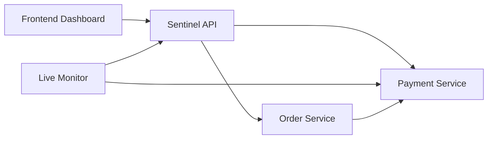

# SentinelAI

SentinelAI is an AI-powered anomaly-detection and monitoring platform for microservices. It watches payment and order traffic, identifies latency and error anomalies, and exposes a lightweight live dashboard for operational visibility.

## What it does

- monitors service health across a small microservice stack
- detects latency anomalies using an Isolation Forest model
- tracks lifecycle-based incidents with ACTIVE and RESOLVED states
- records service metrics and displays them in a live dashboard
- keeps a history of legacy incidents for backward compatibility

## Architecture



## Tech stack

- Python
- FastAPI
- scikit-learn
- NumPy
- Vanilla HTML/CSS/JavaScript
- Docker Compose

## Quick start

1. Clone the repository.
2. Start the full stack:

```bash
docker compose up --build -d
```

3. Open the dashboard:

- http://localhost:3000

4. API endpoints:

- http://localhost:8002/health
- http://localhost:8002/api/anomalies
- http://localhost:8002/api/metrics

## Controlled window evaluation

Run the reproducible evaluation outside Docker after installing the Python dependencies:

```bash
python -m ml.evaluate_window_detector
```

The harness generates seeded NORMAL, SLOW, and FAILURE request windows in memory, trains the rolling-window model on separate normal windows, and reports the detector's actual anomaly counts and scores. It also evaluates mild-to-extreme latency degradation and multiple error rates across five deterministic seeds. It does not write to PostgreSQL or affect the live monitor.

## Example workflow

- Payment service runs in normal, slow, or fail mode.
- The live monitor reads payment metrics in real time.
- Latency anomalies create an ACTIVE incident.
- Healthy traffic resolves that incident automatically.
- The dashboard shows active incidents and incident history separately.

## Portfolio deployment

The simplest realistic public setup is one managed PostgreSQL database, three small web services for `order-service`, `payment-service`, and `sentinel-api`, one background worker for `live-monitor`, and a static frontend host. Render, Railway, or a similar platform can provide the web services, worker, and managed database without introducing Kubernetes.

For hosted services, set these environment variables in each service:

- `DATABASE_URL` — the managed PostgreSQL connection string
- `ORDER_SERVICE_URL` — the reachable order-service URL for `sentinel-api`
- `PAYMENT_SERVICE_URL` — the reachable payment-service URL for order-service and `sentinel-api`
- `CORS_ORIGINS` — the exact public frontend origin, such as `https://sentinel-demo.example.com`
- `ALERT_WEBHOOK_URL`, `ALERT_RECOVERY_ENABLED`, and `ALERT_WEBHOOK_TIMEOUT_SECONDS` for the worker when notifications are desired

Run the Python services with their production commands:

```bash
uvicorn main:app --host 0.0.0.0 --port $PORT
python -u live_monitor.py
```

For a separately hosted frontend, copy `frontend/config.js.example` to `frontend/config.js`, set `window.SENTINEL_API_URL` to the public `sentinel-api` URL, and publish the `frontend` directory as static files. The local workflow remains `docker compose up --build -d`; Compose supplies local defaults and generates `frontend/config.js` automatically.

Do not commit `.env`, `frontend/config.js`, database credentials, or runtime JSONL files. Configure secrets in the hosting provider instead.

## Core project files

- `services/payment-service/main.py` — payment service behavior and metrics
- `services/order-service/main.py` — order orchestration and request tracking
- `services/sentinel-api/main.py` — API for metrics and incidents
- `ml/live_monitor.py` — live incident detection and lifecycle handling
- `frontend/index.html` — dashboard shell
- `frontend/app.js` — frontend logic and filtering
- `frontend/styles.css` — dashboard styling

## Portfolio-ready highlights

- AI/ML anomaly detection for service latency
- operational monitoring pipeline for microservices
- live dashboard with metrics and incident lifecycle tracking
- Dockerized system for reproducible local deployment
- incident history and legacy compatibility handling

## Next steps

- configure a public hosting provider using the deployment steps above
- connect a webhook destination for portfolio demonstrations
