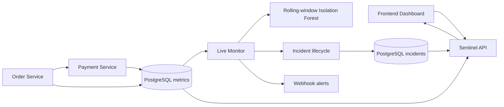

# SentinelAI

SentinelAI is an AI-powered microservice observability platform built to show how application telemetry, anomaly detection, persistence, and incident operations fit together. It collects real-time request metrics, stores metrics and incidents in PostgreSQL, detects abnormal service behavior, manages incident lifecycles, sends optional webhook alerts, and exposes a live monitoring dashboard.

## Demo / Dashboard

The dashboard is available locally at `http://localhost:3000` after starting the stack. No screenshots are committed yet. Add these captures later under `docs/screenshots/`:

- `healthy-dashboard.png` — healthy services, recent metrics, and no active incidents
- `active-anomaly-incident.png` — an active latency or HTTP failure incident
- `resolved-incident.png` — the same incident after recovery, shown in history

## Architecture



The live monitor reads new PostgreSQL metrics, while the JSONL files remain a development fallback when the database is unavailable. The original single-request latency detector remains in the repository alongside the rolling-window detector.

## Features

- FastAPI order, payment, and monitoring microservices
- Real-time request metric collection
- PostgreSQL persistence for metrics and incidents
- `ACTIVE -> RESOLVED` incident lifecycle
- Incident deduplication by service, endpoint, and incident type
- `HIGH` and `CRITICAL` severity classification
- Webhook alerting without notification spam on incident updates
- Optional one-time recovery notifications
- Live dashboard with service health, latency history, and incident filtering
- Docker Compose orchestration with health-aware startup
- Container health checks
- GitHub Actions CI and automated tests

## ML / Anomaly Detection

The rolling-window detector aggregates payment-service request metrics into fixed time windows. Its features include:

- request rate
- mean latency
- p95 latency
- p99 latency
- error rate
- latency standard deviation
- maximum latency

An Isolation Forest is trained only on normal training windows. Separate normal calibration data determines the anomaly threshold using the 95th percentile of SentinelAI's anomaly score. Completely separate held-out normal, slow, and failure windows are then used for evaluation.

The system uses a hybrid architecture: ML detects behavioral shifts, while deterministic rules handle explicit operational conditions such as HTTP failures and latency limits. The model is not presented as a substitute for operational rules or as production-scale ML accuracy.

## Evaluation Results

The controlled robustness evaluation uses five deterministic random seeds, normal-only training and calibration, and 100 windows per scenario after combining the seeds.

Average calibrated threshold: approximately `0.5925`.

| Scenario | Detection rate | Average score | Average latency / error rate |
| --- | ---: | ---: | ---: |
| Normal baseline | approximately 4% anomaly rate | 0.4838 | 100.1 ms / 0% |
| Mild latency degradation | 100% | 0.6742 | 125.2 ms / 0% |
| Moderate latency degradation | 100% | 0.6881 | 175.4 ms / 0% |
| Severe latency degradation | 100% | 0.6938 | 300.6 ms / 0% |
| Extreme latency degradation | 100% | 0.6938 | 901.8 ms / 0% |
| Low error rate, 8.3% | 8% | 0.4924 | 100.0 ms / 8.3% |
| Moderate error rate, 25% | 9% | 0.4916 | 100.2 ms / 25% |
| High error rate, 50% | 16% | 0.5003 | 100.0 ms / 50% |

Latency degradation is reliably detected in these controlled scenarios. Error-rate-only degradation is a weaker region, so SentinelAI deliberately combines ML with deterministic operational rules rather than claiming that the model solves every failure mode. These are controlled synthetic results, not production traffic or a claim of `100% model accuracy`.

## Tech Stack

- Python
- FastAPI
- PostgreSQL
- scikit-learn
- NumPy
- Docker
- Docker Compose
- JavaScript, HTML, and CSS
- pytest
- GitHub Actions

## Incident Lifecycle

```text
HEALTHY
  -> anomaly detected
  -> ACTIVE incident
  -> repeated failures update the same incident
  -> recovery
  -> RESOLVED incident
```

Each incident records an ID, timestamps, severity, endpoint, latest latency/status information, and `occurrence_count`. Deduplication keeps one ongoing incident per service, endpoint, and incident type, preventing repeated requests from creating duplicate incidents or alerts.

## Quick Start

Start the complete local stack:

```bash
docker compose up --build -d
```

Open the dashboard:

```text
http://localhost:3000
```

Important API endpoints:

- `http://localhost:8000/health` — order-service health
- `http://localhost:8000/orders` — create an order
- `http://localhost:8001/health` — payment-service health and current mode
- `http://localhost:8001/payments` — process a payment
- `http://localhost:8001/mode` — switch `normal`, `slow`, or `fail` mode
- `http://localhost:8002/health` — Sentinel API health
- `http://localhost:8002/api/services` — monitored service health
- `http://localhost:8002/api/metrics` — recent payment metrics
- `http://localhost:8002/api/anomalies` — active and historical incidents

Stop the stack:

```bash
docker compose down
```

For local configuration overrides, copy `.env.example` to `.env`. The Compose workflow supplies service-to-service defaults. Hosted PostgreSQL can be configured with `DATABASE_URL`; hosted deployments should also set `ORDER_SERVICE_URL`, `PAYMENT_SERVICE_URL`, `CORS_ORIGINS`, and `FRONTEND_SENTINEL_API_URL` as appropriate. Keep secrets in the hosting provider, not in GitHub.

## Testing

Run the verified test suite locally:

```bash
. .venv/bin/activate
pytest -q
```

The current verified result is **15 passed** with one existing dependency deprecation warning.

The deterministic ML evaluation can be run separately:

```bash
python -m ml.evaluate_window_detector
```

## Repository Structure

- `services/order-service/` — order API and request telemetry
- `services/payment-service/` — payment API, fault modes, and telemetry
- `services/sentinel-api/` — dashboard API and service health checks
- `database/` — PostgreSQL metric and incident stores
- `ml/detector.py` — original single-request latency detector
- `ml/window_detector.py` — rolling-window feature aggregation and model
- `ml/live_monitor.py` — live metric processing and incident lifecycle
- `ml/evaluate_window_detector.py` — reproducible ML evaluation harness
- `frontend/` — dashboard files and runtime API configuration
- `tests/` — API, persistence, alerting, detector, and evaluation tests
- `docker-compose.yml` — local multi-service orchestration
- `.github/workflows/ci.yml` — GitHub Actions test workflow

## Project Status

SentinelAI is feature-complete for its current portfolio scope. The repository demonstrates a complete local observability workflow from service request to persisted telemetry, live detection, incident lifecycle, dashboard visibility, and optional notification. It does not claim public deployment or production-scale usage.

### Possible Future Improvements

Optional next steps include deploying the existing stack publicly for a portfolio demo and adding more notification providers. These are deployment and extension options, not missing core functionality.

## Design Decisions / Engineering Lessons

- Combining ML detection with deterministic operational rules makes the system useful even where the model has known weak regions.
- Calibrating thresholds from normal-only data avoids selecting a cutoff against abnormal test results.
- Incident deduplication prevents alert spam while preserving occurrence counts and lifecycle history.
- PostgreSQL is the primary persistence layer; JSONL remains a resilience and development fallback.
- Health-aware Docker startup makes dependency readiness explicit and keeps the local stack reproducible.
